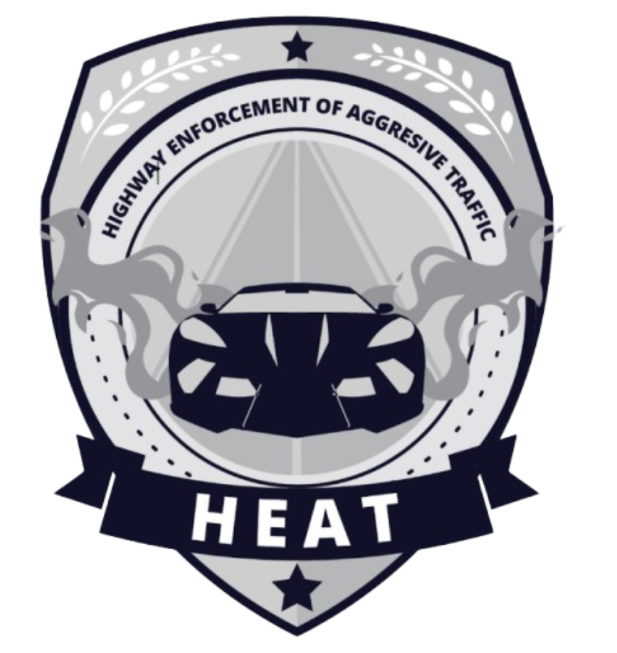

# HEAT — Highway Enforcement of Aggressive Traffic

> High-Speed Pursuit Interceptor Unit · GTA V Roleplay Division



## Overview

HEAT is a specialized highway enforcement unit built around one purpose — intercepting aggressive drivers and street racers that standard patrol units cannot match. Officers are assigned purpose-built, high-performance interceptor vehicles capable of sustaining pursuit at speeds that exceed most illegal race cars on the highway.

This is the official unit website for the HEAT division, featuring standard operating procedures, unit roles, and operational instructions.

## Pages

- **Home** — Cinematic hero with unit status and capability overview
- **Racing SOP** — Step-by-step protocol for street racing enforcement operations
- **SOI** — Standard Operating Instructions covering HEAT unit roles and ASD support

## Tech Stack

- React 18 + Vite 5
- Framer Motion 11
- React Router DOM 6
- CSS custom properties + glassmorphism

## Development

```bash
npm install
npm run dev
```

Open [http://localhost:5173](http://localhost:5173)

## Build

```bash
npm run build
```

---

Built & maintained by [Anubhav Kumar](https://anubhavkumaar.in)
